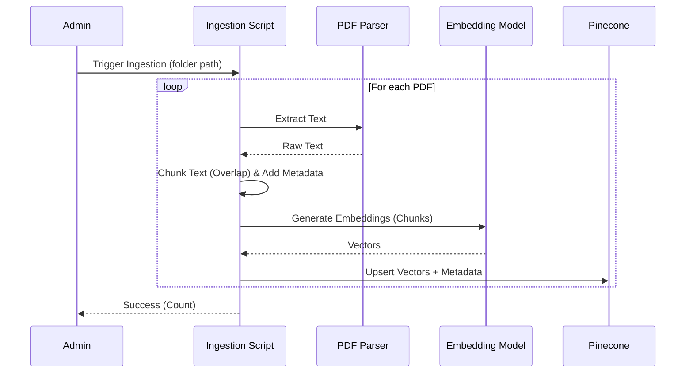
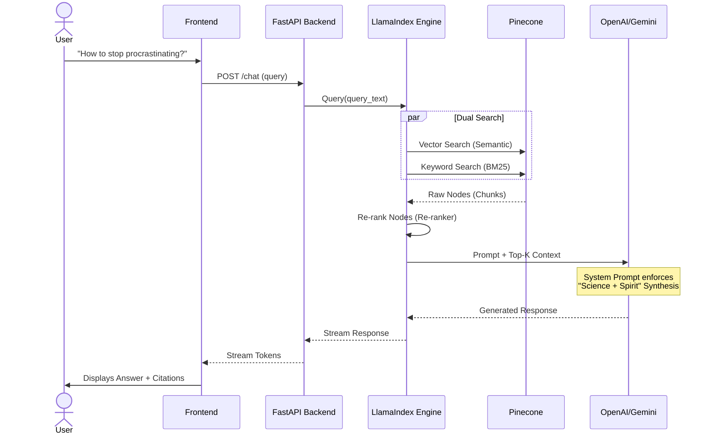

# System Architecture: "The Modern Sage"

## High-Level Component Diagram

```mermaid
graph TD
    subgraph "Frontend Layer (Next.js)"
        UI[Web UI / Chat Interface]
        State[Chat State Manager]
    end

    subgraph "Backend Layer (FastAPI)"
        API[API Endpoints /chat]
        Orch[LlamaIndex Orchestrator]
        Ingest[Ingestion Service]
    end

    subgraph "Data & AI Layer"
        Pinecone[(Pinecone Vector DB)]
        LLM[LLM (OpenAI/Gemini)]
        Files[Raw PDFs]
    end

    %% Interactions
    UI <-->|"JSON Stream"| API
    API --> Orch
    Orch <-->|"Retrieve & Re-rank"| Pinecone
    Orch <-->|"Generate"| LLM
    Ingest -->|"Parse & Chunk"| Files
    Ingest -->|"Embed & Upsert"| Pinecone
```

## Detailed Data Flows

### 1. Ingestion Flow (Offline / Admin Trigger)
How books get into the "Brain".



### 2. RAG Query Flow (Runtime)
How a user question becomes an answer.


